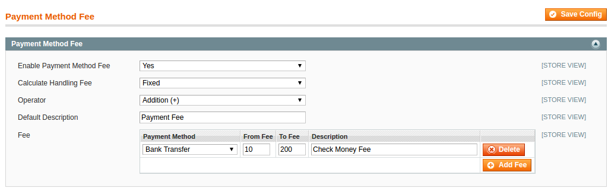

Description
-----------

Magento Add Ramdom Fee or Discount to order Totals.

In a typical order, the order totals usually comprises of Sub Total, Shipping Cost, Taxes, Discount, based on these values the total order grand total is calculated.

This module adds a new line to order Totals. You can add an additional Payment Fee which will affect the order grand total.

This extension based on  Payment Fee module (https://github.com/devromans/payment-fee.git)

Questions in magento.stackexchange.com (http://magento.stackexchange.com/questions/144552/magento-1-9-add-random-fee-to-order-totals)

Compatibility
-------------

Magento 1.9.x

Screenshots
----------

Extension Configuration

Checkout Totals

